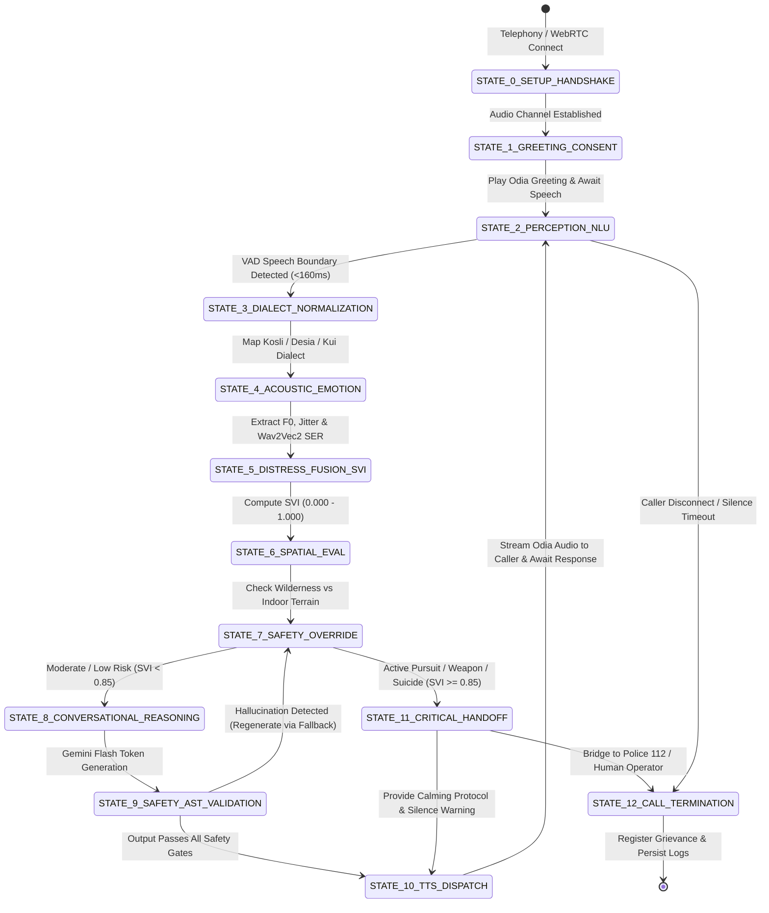
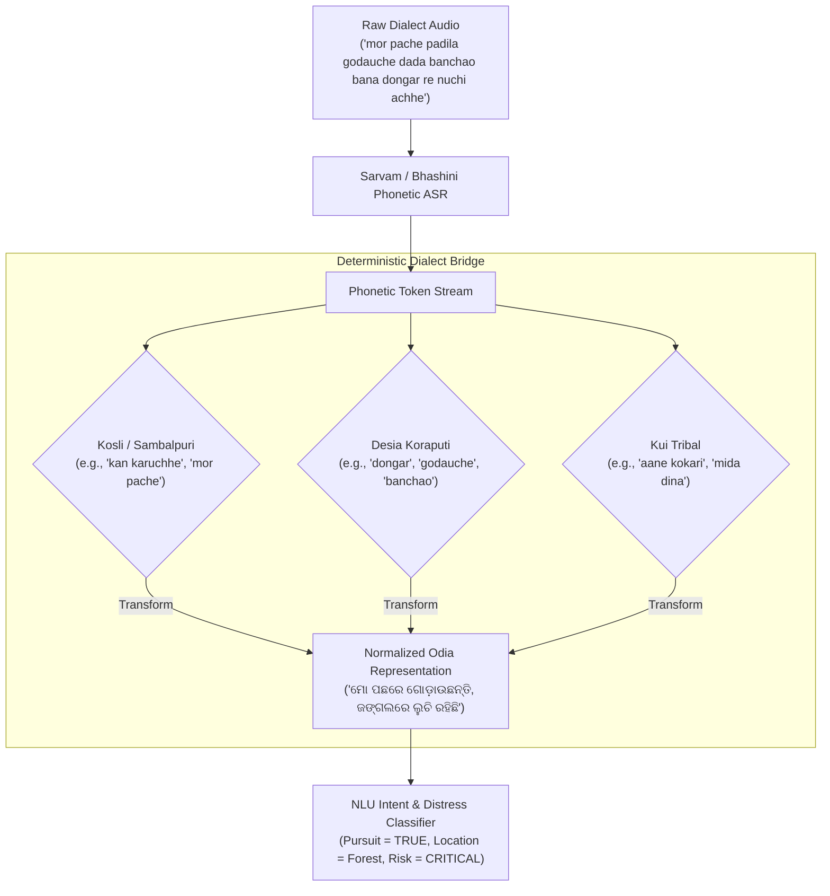

# Conversational Voice Agent State Machine & Decision Flow (Agent Flow)
## Project SAHAY (ସହାୟ) – Real-Time Voice Triage Engine
**Document Version:** 2.0  
**Target Solution:** Smart India Hackathon (SIH 2026) – Problem Statement 26093  
**Status:** Approved & Production-Active  

---

## 1. High-Level Finite State Machine (FSM)

The SAHAY voice agent operates as a deterministic, asynchronous Finite State Machine (FSM) engineered to eliminate hallucinations, enforce clinical safety protocols, and execute rapid emergency dispatch.



---

## 2. State Transition Matrix & Functional Guards

| State | Entry Condition / Guard | Processing & Execution Logic | Next State |
| :--- | :--- | :--- | :--- |
| **STATE 0: Handshake** | Telephony WebSocket connects (`/ws/exotel/{call_id}`) or browser connects | Initializes `ConversationStateManager`, allocates circular audio buffers, starts VAD listener. | `STATE 1: Greeting` |
| **STATE 1: Greeting & Consent** | Channel active | Synthesizes warm bilingual Odia greeting: *"Namaskar, mu Sahay agent kahuchhi..."*, logs DPDP statutory notice. | `STATE 2: Perception` |
| **STATE 2: Perception & VAD** | Caller audio input | Energy flux VAD detects speech boundary in $<160\text{ ms}$; buffers 16kHz PCM; ignores constant vehicle horns (<300Hz). | `STATE 3: Dialect` |
| **STATE 3: Dialect Normalization** | Raw transcript received from Sarvam Saaras / Bhashini | `DialectBridge` evaluates phonetic regex rules; maps Kosli, Desia, Kui, and Broken Odia phrases to standard semantic roots. | `STATE 4: Acoustic` |
| **STATE 4: Acoustic & Emotion** | Parallel audio frame available | openSMILE extracts Mean Pitch $F_0$, jitter, shimmer, pause ratio; Wav2Vec2-XLSR outputs $[P_{\text{fear}}, P_{\text{sadness}}, P_{\text{anger}}, P_{\text{neutral}}]$. | `STATE 5: Fusion` |
| **STATE 5: Distress Fusion (SVI)** | Acoustic + emotion + linguistic vectors ready | Computes Stress Vulnerability Index ($SVI \in [0.0, 1.0]$). Checks for prank laughter vs genuine trauma markers. | `STATE 6: Spatial` |
| **STATE 6: Spatial Evaluation** | SVI calculated | Scans transcript and acoustic cues for outdoor/forest keywords (`jungle`, `bana`, `godau`, `chasing`, `rasta`, `highway`). | `STATE 7: Safety Override` |
| **STATE 7: Safety Override** | Spatial status resolved | **If Wilderness Pursuit OR Weapon OR Suicide Threat:** Trigger immediate override. Skip general LLM reasoning. | `STATE 11` if Critical; else `STATE 8` |
| **STATE 8: LLM Reasoning** | Routine / Moderate distress | Queries verified RAG store (PoA Act, DLSA legal aid, 14566 schemes); prompts Gemini Flash Lite with grounded constraints. | `STATE 9: Validation` |
| **STATE 9: Safety AST Validation** | LLM text generated | AST Validator inspects output. Blocks non-helpline phone numbers, victim blaming, clinical diagnoses, and door-locking advice in wilderness. | `STATE 10` if Clean; else fallback |
| **STATE 10: TTS Dispatch** | Validated text ready | Sarvam Bulbul synthesizes expressive Odia/Hindi voice stream. Dispatches audio packets to Exotel/WebRTC stream. | `STATE 2: Perception` |
| **STATE 11: Critical Handoff** | Life threat / SVI $\ge 0.85$ | 1. Triggers emergency alert to Operator Dashboard.<br/>2. Auto-generates SBAR report.<br/>3. Advises caller to dim screen & stay quiet.<br/>4. Queues PCR 112 dispatch. | `STATE 10: TTS` & `STATE 12` |
| **STATE 12: Termination & Logging** | Caller hangs up or handoff complete | Flushes audit log to Supabase; persists complaint record with caller phone; cleans ephemeral RAM buffers. | `[*]` Exit |

---

## 3. Specialized Subsystem Algorithms

### 3.1 Spatial Awareness & Wilderness Pursuit Algorithm

```python
def evaluate_spatial_and_wilderness_safety(transcript: str, current_state: ConversationState) -> Dict[str, Any]:
    """
    Guarantees zero door-locking hallucinations in outdoor/forest pursuit scenarios.
    """
    WILDERNESS_KEYWORDS = [
        "jungle", "jangala", "bana", "bir", "forest", "field", 
        "chasing", "godau", "pache padila", "rasta", "bridge", "mandira"
    ]
    
    is_wilderness = any(kw in transcript.lower() for kw in WILDERNESS_KEYWORDS)
    
    if is_wilderness:
        current_state.environment = "WILDERNESS_OUTDOOR"
        current_state.banned_phrases = [
            "lock the door", "lock all doors", "kabata banda", "stay inside", 
            "close windows", "ghara bhitare rahantu"
        ]
        return {
            "environment": "WILDERNESS_OUTDOOR",
            "enforced_guidance": "MOBILE_SILENT_NATURAL_CONCEALMENT_LANDMARK_DISPATCH",
            "police_priority": "PCR_112_HIGH_URGENCY",
            "safe_prompt": "Mu apananka katha suniparuchhi. Daya kari chupi chap nuchi rahantu, "
                           "mobile sound silent karantu, o pakhare thiba rasta ba mandira bisayare kahantu. "
                           "Police PCR 112 pathauchu."
        }
    return {"environment": "INDOOR_OR_UNDEFINED", "banned_phrases": []}
```

---

### 3.2 Dialect Transformation Bridge (Kosli / Desia / Kui)



---

### 3.3 Interruption & Barge-in Protocol (<160ms)

1. While TTS is actively streaming audio to the caller, the VAD process monitors the incoming uplink channel in 20ms sliding windows.
2. If energy and spectral flux cross threshold for $\ge 8$ consecutive frames ($160\text{ ms}$):
   - An `INTERRUPT_SIGNAL` is dispatched to the audio output queue.
   - The ongoing TTS playback stream is terminated immediately.
   - The agent transitions to `STATE_2_PERCEPTION_NLU` to prioritize the caller's spoken input without delay.
