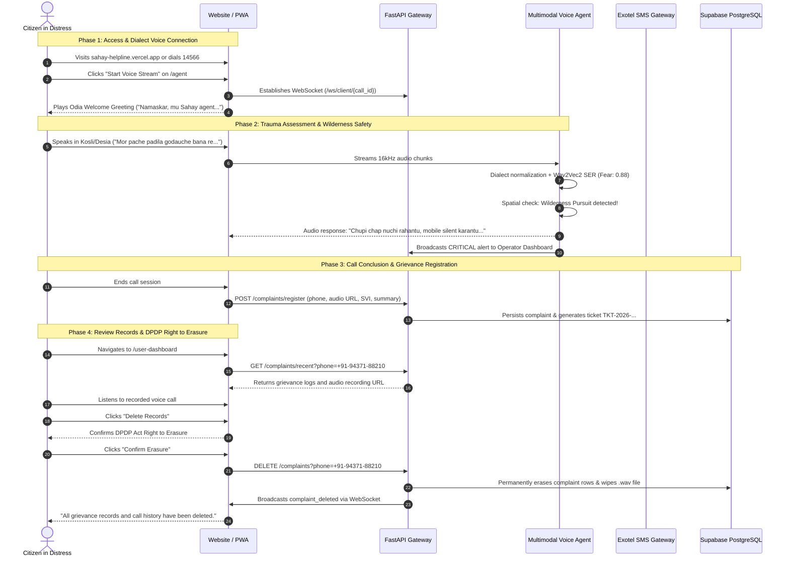
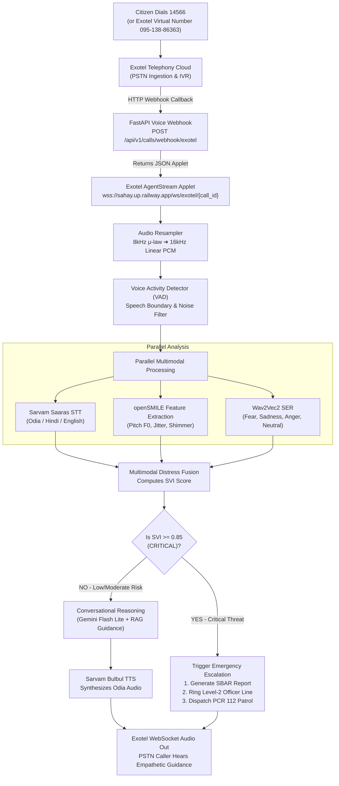
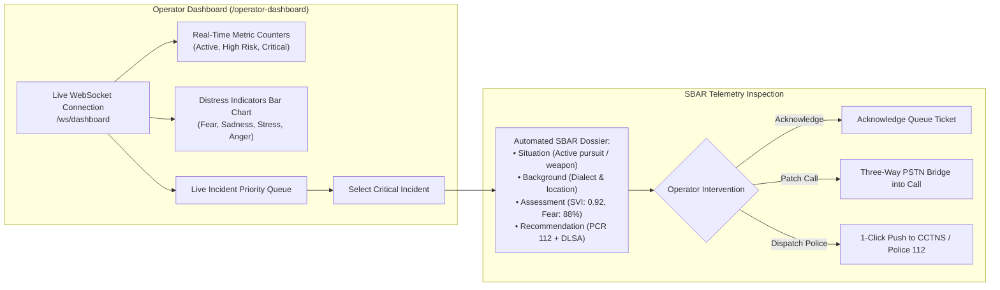
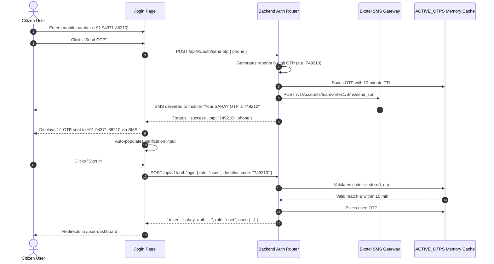

# Application & Interaction Flow (App Flow)
## Project SAHAY (ସହାୟ) – Voice Agent & Crisis Helpline System
**Document Version:** 2.0  
**Target Solution:** Smart India Hackathon (SIH 2026) – Problem Statement 26093  
**Status:** Approved & Production-Active  

---

## 1. System Navigation & Sitemap Architecture

The SAHAY application architecture is structured into two primary portals:
1. **Public Citizen Helpline Portal** (No mandatory login required; instant access to voice agent, case history, resources, and statutory data erasure).
2. **Authorized Operator & Triage Console** (Role-authenticated workspace for live telemetry monitoring, queue management, and SBAR emergency dispatch).

### Visual System Workflow Infographic


```
SAHAY Portal Root (/)
 │
 ├── [Home Page (/)]
 │    ├── Hero Banner ("14566 National Helpline Against Atrocities")
 │    ├── Instant Emergency Call CTA ("Dial 14566" / "Start Voice Call")
 │    ├── Comprehensive Crisis Services Grid
 │    ├── Essential Resources for Citizens in Distress
 │    │    └── Learn More (/essential-resources) [Dropdown Q&A Guide]
 │    ├── Voice Distress Architecture & Dialect Coverage Showcase
 │    └── Statutory DPDP 2023 Compliance & Privacy Notice
 │
 ├── [AI Voice & Text Agent (/agent)]
 │    ├── Real-Time Voice Stream (Live microphone / WebRTC stream)
 │    │    ├── Live Animated Audio Waveform
 │    │    ├── Session Timer & Dialect Auto-Detect Badge
 │    │    ├── Live Prosody Telemetry (SVI, Pitch F0, Jitter, Voice Activity)
 │    │    ├── Direct Call 14566 Button
 │    │    └── Linked Caller Line ID (Phone Input with Instant Sync)
 │    ├── Text Guidance Chat (Bilingual Odia/English distress support)
 │    └── View My Complaints & Audio Recordings Link
 │
 ├── [Citizen Grievance Logs & Audio Recordings (/user-dashboard)]
 │    ├── Public Access Status Indicator ("No Login Required")
 │    ├── Active Caller Phone Display & Switch Form
 │    ├── Registered Complaints & Audio Playback Cards
 │    │    ├── Audio Waveform Player (/api/v1/recordings/*.wav)
 │    │    ├── Risk Badge (LOW, MODERATE, HIGH, CRITICAL)
 │    │    ├── Recommended Statutory Services (DLSA, PCR 112, 14416)
 │    │    └── Lower-Right Action Group:
 │    │         ├── Withdraw & Erase Single Complaint (DPDP Right to Erasure)
 │    │         └── Delete Audio Recording
 │    └── "Delete Records" Global Action (Wipes all local & server records)
 │
 ├── [Secure Portal Sign In (/login)]
 │    ├── Citizen Portal Tab
 │    │    ├── Registered Mobile Input
 │    │    ├── "Send OTP" Button (Triggers 6-digit random SMS OTP via Exotel)
 │    │    ├── Verification Code Input (Auto-populated with sent OTP)
 │    │    └── Direct Sign In Action
 │    └── Helpline Operator Tab
 │         ├── Officer Badge / Staff ID Input
 │         └── Authorized Security PIN Verification
 │
 ├── [Operator Live Telemetry Dashboard (/operator-dashboard)]
 │    ├── High-Distress Emergency Alert Banner (Active Pursuit / Weapons)
 │    ├── Active Call Sessions Metric Cards (Active, High Risk, Critical, Escalations)
 │    ├── Distress Indicators Bar Chart (Fear, Sadness, Anger, Stress, Voice Tremor)
 │    ├── Real-Time Telemetry Stream (Live SVI, Acoustic Prosody, Speech Emotion)
 │    ├── Live Incident Queue & SBAR Handoff Drawer
 │    └── Real-Time WebSocket Listener (Syncs deletions and registrations live)
 │
 └── [Contact & Legal Inquiries (/contact)]
      ├── District Legal Services Inquiry Form
      └── Emergency Contact Directory (112, 14566, 181, 14416)
```

---

## 2. Citizen User Journey Flowchart



---

## 3. Inbound Telephony (PSTN) Call Flow



---

## 4. Operator Dashboard & Emergency Handoff Flow



---

## 5. Mobile OTP Authentication Flow


