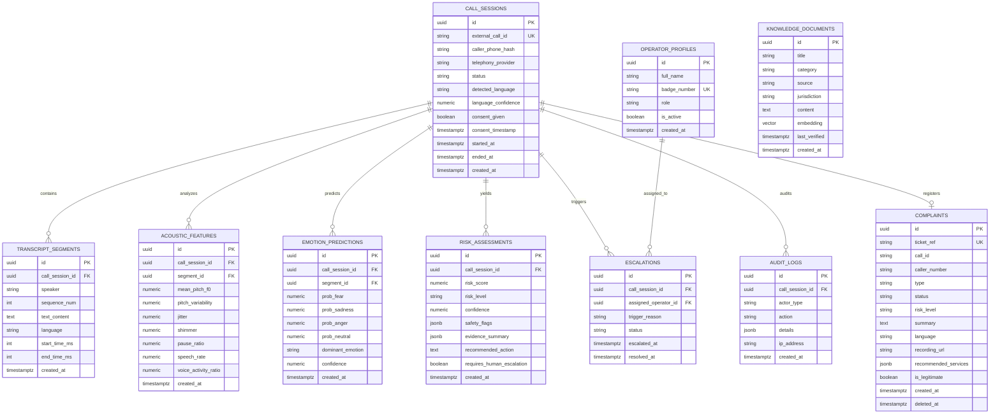

# Backend Database & Relational Schema Specification
## Project SAHAY (ସହାୟ) – Supabase / PostgreSQL Architecture
**Document Version:** 2.0  
**Database Engine:** PostgreSQL 15+ with `uuid-ossp` and `vector` (pgvector) extensions  
**Target Solution:** Smart India Hackathon (SIH 2026) – Problem Statement 26093  
**Status:** Approved & Production-Active  

---

## 1. Entity-Relationship (ER) Architecture



---

## 2. Table Definitions & SQL DDL

### 2.1 Table: `call_sessions`
Represents the overarching conversational interaction, tracking metadata, duration, consent, and language.

```sql
CREATE TABLE IF NOT EXISTS call_sessions (
    id UUID PRIMARY KEY DEFAULT uuid_generate_v4(),
    external_call_id TEXT UNIQUE NOT NULL,
    caller_phone_hash TEXT NOT NULL, -- Salted SHA-256 hash (never raw phone number)
    telephony_provider TEXT NOT NULL DEFAULT 'mock', -- 'exotel', 'webrtc', 'mock'
    status TEXT CHECK (status IN ('initiated', 'in_progress', 'escalated', 'completed', 'abandoned')) DEFAULT 'initiated',
    detected_language TEXT DEFAULT 'und', -- 'or-IN', 'sp-IN', 'des-IN', 'kui-IN', 'hi-IN', 'en-IN'
    language_confidence NUMERIC(4,3) DEFAULT 0.000,
    consent_given BOOLEAN DEFAULT FALSE,
    consent_timestamp TIMESTAMPTZ,
    started_at TIMESTAMPTZ DEFAULT NOW(),
    ended_at TIMESTAMPTZ,
    created_at TIMESTAMPTZ DEFAULT NOW()
);

CREATE INDEX idx_call_sessions_status ON call_sessions(status);
CREATE INDEX idx_call_sessions_external_id ON call_sessions(external_call_id);
CREATE INDEX idx_call_sessions_phone_hash ON call_sessions(caller_phone_hash);
```

---

### 2.2 Table: `transcript_segments`
Stores turn-by-turn spoken dialogue segments with millisecond timing boundaries.

```sql
CREATE TABLE IF NOT EXISTS transcript_segments (
    id UUID PRIMARY KEY DEFAULT uuid_generate_v4(),
    call_session_id UUID NOT NULL REFERENCES call_sessions(id) ON DELETE CASCADE,
    speaker TEXT CHECK (speaker IN ('caller', 'agent', 'operator')) NOT NULL,
    sequence_num INT NOT NULL,
    text_content TEXT NOT NULL,
    language TEXT DEFAULT 'or-IN',
    start_time_ms INT NOT NULL,
    end_time_ms INT NOT NULL,
    created_at TIMESTAMPTZ DEFAULT NOW()
);

CREATE INDEX idx_transcript_segments_call ON transcript_segments(call_session_id);
CREATE INDEX idx_transcript_segments_seq ON transcript_segments(call_session_id, sequence_num);
```

---

### 2.3 Table: `acoustic_features`
Stores openSMILE eGeMAPS prosodic feature extractions per conversational turn.

```sql
CREATE TABLE IF NOT EXISTS acoustic_features (
    id UUID PRIMARY KEY DEFAULT uuid_generate_v4(),
    call_session_id UUID NOT NULL REFERENCES call_sessions(id) ON DELETE CASCADE,
    segment_id UUID REFERENCES transcript_segments(id) ON DELETE SET NULL,
    mean_pitch_f0 NUMERIC(6,2),
    pitch_variability NUMERIC(6,2),
    jitter NUMERIC(6,4),
    shimmer NUMERIC(6,4),
    pause_ratio NUMERIC(4,3),
    speech_rate NUMERIC(5,2),
    voice_activity_ratio NUMERIC(4,3),
    created_at TIMESTAMPTZ DEFAULT NOW()
);

CREATE INDEX idx_acoustic_features_call ON acoustic_features(call_session_id);
```

---

### 2.4 Table: `emotion_predictions`
Stores Speech Emotion Recognition (SER) probability distribution from Wav2Vec2.

```sql
CREATE TABLE IF NOT EXISTS emotion_predictions (
    id UUID PRIMARY KEY DEFAULT uuid_generate_v4(),
    call_session_id UUID NOT NULL REFERENCES call_sessions(id) ON DELETE CASCADE,
    segment_id UUID REFERENCES transcript_segments(id) ON DELETE SET NULL,
    prob_fear NUMERIC(4,3) NOT NULL,
    prob_sadness NUMERIC(4,3) NOT NULL,
    prob_anger NUMERIC(4,3) NOT NULL,
    prob_neutral NUMERIC(4,3) NOT NULL,
    dominant_emotion TEXT NOT NULL,
    confidence NUMERIC(4,3) NOT NULL,
    created_at TIMESTAMPTZ DEFAULT NOW()
);

CREATE INDEX idx_emotion_predictions_call ON emotion_predictions(call_session_id);
```

---

### 2.5 Table: `risk_assessments`
Multimodal distress fusion records computing the Stress Vulnerability Index (SVI).

```sql
CREATE TABLE IF NOT EXISTS risk_assessments (
    id UUID PRIMARY KEY DEFAULT uuid_generate_v4(),
    call_session_id UUID NOT NULL REFERENCES call_sessions(id) ON DELETE CASCADE,
    risk_score NUMERIC(4,3) NOT NULL, -- SVI score (0.000 to 1.000)
    risk_level TEXT CHECK (risk_level IN ('LOW', 'MODERATE', 'HIGH', 'CRITICAL')) NOT NULL,
    confidence NUMERIC(4,3) NOT NULL,
    safety_flags JSONB DEFAULT '{}'::jsonb, -- {"weapon_present": false, "active_pursuit": true}
    evidence_summary JSONB DEFAULT '[]'::jsonb,
    recommended_action TEXT NOT NULL,
    requires_human_escalation BOOLEAN DEFAULT FALSE,
    created_at TIMESTAMPTZ DEFAULT NOW()
);

CREATE INDEX idx_risk_assessments_call ON risk_assessments(call_session_id);
CREATE INDEX idx_risk_assessments_level ON risk_assessments(risk_level);
```

---

### 2.6 Table: `complaints`
Stores citizen-facing grievance records, statutory references, audio links, and DPDP status.

```sql
CREATE TABLE IF NOT EXISTS complaints (
    id UUID PRIMARY KEY DEFAULT uuid_generate_v4(),
    ticket_ref TEXT UNIQUE NOT NULL, -- e.g. TKT-2026-0907-8821
    call_id TEXT NOT NULL,
    caller_number TEXT NOT NULL, -- Displayed to citizen on portal; purged upon Right to Erasure
    type TEXT DEFAULT 'voice',
    status TEXT DEFAULT 'REGISTERED_ACTIVE_TRIAGE',
    risk_level TEXT CHECK (risk_level IN ('LOW', 'MODERATE', 'HIGH', 'CRITICAL')) DEFAULT 'HIGH',
    summary TEXT NOT NULL,
    language TEXT DEFAULT 'or-IN',
    recording_url TEXT, -- Path to audio playback (/api/v1/recordings/*.wav)
    recommended_services JSONB DEFAULT '["14566 National Helpline", "DLSA Legal Aid Council"]'::jsonb,
    is_legitimate BOOLEAN DEFAULT TRUE,
    created_at TIMESTAMPTZ DEFAULT NOW(),
    deleted_at TIMESTAMPTZ -- Populated when citizen triggers DPDP Right to Erasure
);

CREATE INDEX idx_complaints_ticket ON complaints(ticket_ref);
CREATE INDEX idx_complaints_call ON complaints(call_id);
CREATE INDEX idx_complaints_caller ON complaints(caller_number);
```

---

### 2.7 Table: `escalations`
Active Level-2 human operator queue items.

```sql
CREATE TABLE IF NOT EXISTS escalations (
    id UUID PRIMARY KEY DEFAULT uuid_generate_v4(),
    call_session_id UUID NOT NULL REFERENCES call_sessions(id) ON DELETE CASCADE,
    assigned_operator_id UUID REFERENCES auth.users(id) ON DELETE SET NULL,
    trigger_reason TEXT NOT NULL,
    status TEXT CHECK (status IN ('pending', 'acknowledged', 'resolved')) DEFAULT 'pending',
    escalated_at TIMESTAMPTZ DEFAULT NOW(),
    resolved_at TIMESTAMPTZ
);

CREATE INDEX idx_escalations_status ON escalations(status);
```

---

### 2.8 Table: `knowledge_documents`
Verified legal knowledge store with 768-dimensional vector embeddings for RAG grounding.

```sql
CREATE TABLE IF NOT EXISTS knowledge_documents (
    id UUID PRIMARY KEY DEFAULT uuid_generate_v4(),
    title TEXT NOT NULL,
    category TEXT CHECK (category IN ('emergency', 'legal', 'medical', 'counselling', 'scheme')) NOT NULL,
    source TEXT NOT NULL,
    jurisdiction TEXT DEFAULT 'National',
    content TEXT NOT NULL,
    embedding VECTOR(768),
    last_verified TIMESTAMPTZ DEFAULT NOW(),
    created_at TIMESTAMPTZ DEFAULT NOW()
);

CREATE INDEX idx_knowledge_category ON knowledge_documents(category);
```

---

### 2.9 Table: `audit_logs`
Tamper-evident statutory audit trail tracking data access and erasure operations.

```sql
CREATE TABLE IF NOT EXISTS audit_logs (
    id UUID PRIMARY KEY DEFAULT uuid_generate_v4(),
    call_session_id UUID REFERENCES call_sessions(id) ON DELETE SET NULL,
    actor_type TEXT CHECK (actor_type IN ('system', 'operator', 'citizen', 'api')) NOT NULL,
    action TEXT NOT NULL, -- e.g. 'CITIZEN_DPDP_RIGHT_TO_ERASURE', 'ESCALATION_DISPATCH'
    details JSONB DEFAULT '{}'::jsonb,
    ip_address TEXT,
    created_at TIMESTAMPTZ DEFAULT NOW()
);

CREATE INDEX idx_audit_logs_action ON audit_logs(action);
```

---

## 3. Row Level Security (RLS) & Privacy Policies

To enforce statutory DPDP compliance and protect citizen privacy:

```sql
-- Enable RLS across all tables
ALTER TABLE call_sessions ENABLE ROW LEVEL SECURITY;
ALTER TABLE transcript_segments ENABLE ROW LEVEL SECURITY;
ALTER TABLE risk_assessments ENABLE ROW LEVEL SECURITY;
ALTER TABLE escalations ENABLE ROW LEVEL SECURITY;
ALTER TABLE complaints ENABLE ROW LEVEL SECURITY;
ALTER TABLE audit_logs ENABLE ROW LEVEL SECURITY;

-- 1. Public Citizen Access Policy for Complaints
CREATE POLICY "Public citizen complaint view"
ON complaints FOR SELECT
USING (deleted_at IS NULL);

-- 2. Citizen Right to Erasure Policy
CREATE POLICY "Citizen can erase own complaint"
ON complaints FOR DELETE
USING (true);

-- 3. Authorized Operators can view all active sessions
CREATE POLICY "Authorized operators full read"
ON call_sessions FOR SELECT
TO authenticated
USING (true);
```
