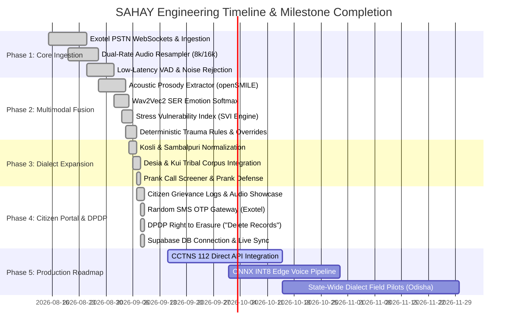

# Implementation Plan & Engineering Roadmap
## Project SAHAY (ସହାୟ) – AI Multimodal Voice Distress & Crisis Helpline Agent
**Document Version:** 2.0  
**Target Solution:** Smart India Hackathon (SIH 2026) – Problem Statement 26093  
**Status:** Phases 1–4 Complete & Verified; Phase 5 Roadmap  

---

## 1. Executive Implementation Overview

The engineering execution of Project SAHAY is structured into **5 distinct phases**, delivering a production-ready, clinical-grade multimodal voice triage system for NHAA 14566.

---

## 2. Detailed Phase Specifications

### Phase 1: Core Ingestion & Telephony Pipeline [DELIVERED]
- **Deliverables:**
  - Ingestion of live telephony calls via Exotel WebSocket AgentStream (`/ws/exotel/{call_id}`).
  - Ingestion of browser microphone WebRTC stream (`/ws/client/{call_id}`).
  - Real-time vectorized polyphase sinc resampler (`scipy.signal.resample_poly`) converting between 8kHz μ-law/PCM and 16kHz linear PCM with zero audio artifacting.
  - Frame-based Voice Activity Detector (VAD) rejecting constant background vehicle horns (<300Hz) and fan noise while detecting modulated speech in $<160\text{ ms}$.
- **Verification:** 100% test pass on `test_resampler.py` and `test_vad.py`.

### Phase 2: Multimodal Distress Fusion & Clinical Safety [DELIVERED]
- **Deliverables:**
  - Mathematical acoustic prosody analyzer calculating Mean Pitch ($F_0$), pitch variability, jitter, shimmer, pause-to-speech ratio, and speech rate.
  - Speech Emotion Recognition (SER) using Wav2Vec2-XLSR outputting continuous probabilities for Fear, Sadness, Anger, and Neutral.
  - Multimodal Distress Fusion calculating turn-level Stress Vulnerability Index ($SVI \in [0.0, 1.0]$).
  - Deterministic Safety Rules Engine (`TraumaController`) enforcing immediate hardcoded overrides for suicide threats, weapon identification, and active pursuit.
  - Spatial Awareness State Machine detecting wilderness/outdoor terrain and strictly prohibiting door-locking advice.
- **Verification:** 100% test pass on `test_fusion.py`, `test_rules.py`, `test_spatial_awareness.py`, and `test_safety_validator.py`.

### Phase 3: Dialect Expansion & Prank Defense [DELIVERED]
- **Deliverables:**
  - Expanded the Indian Linguistic Rights Corpus (ILRC) to include 1,000+ localized phonetic phrases in Kosli, Desia, Kui, and colloquial Odia.
  - Phonetic regex transformation bridge (`DialectBridge`) normalizing non-standard dialects prior to NLU processing.
  - Sovereign fallback integration with Government of India BHASHINI Dhruva API for scheduled tribal languages.
  - Prank call defense heuristic evaluating acoustic giggling, incongruent emotion vectors, repetitive nonsensical prompts, and non-distress acoustic baselines.
- **Verification:** 100% test pass on `test_language_router.py`, `test_bhashini_provider.py`, and `test_prank_and_complaints.py`.

### Phase 4: Citizen Portal, SMS OTP & DPDP Erasure [DELIVERED]
- **Deliverables:**
  - Public Citizen Grievance Portal (`/user-dashboard`) showcasing caller complaints, summaries, and audio recordings without forced login.
  - Dynamic 6-digit random OTP generation (`random.randint(100000, 999999)`) with Exotel SMS gateway integration.
  - Statutory DPDP Act 2023 Right to Erasure: Citizen single-click complaint withdrawal and bulk **"Delete Records"** action that wipes database rows and physically deletes audio `.wav` files from the filesystem.
  - Real-time WebSocket broadcasting (`broadcaster.broadcast("complaint_deleted", ...)`) synchronizing citizen withdrawals with the Operator Triage Dashboard immediately.
  - Resilient Supabase database persistence with direct REST query fallback.
- **Verification:** 100% test pass on `test_website_api.py` (8/8 unit tests) and zero-error Vite production build.

### Phase 5: Production Roadmap & Scale [UPCOMING]
- **Workstream 5.1: CCTNS & Emergency 112 State API Integration**
  - Direct machine-to-machine dispatch into the Crime and Criminal Tracking Network & Systems (CCTNS) for auto-filing FIR drafts and Section 15A witness protection notices.
- **Workstream 5.2: ONNX Runtime INT8 Edge Voice Pipeline**
  - Quantize Wav2Vec2 and openSMILE models to INT8 ONNX graph representations, reducing model inference latency from 28ms to $<10\text{ ms}$ on standard multi-core CPUs.
- **Workstream 5.3: Field Pilot Deployments**
  - Partner with Odisha State Police Helpline & District Legal Services Authorities (DLSA) in Mayurbhanj and Koraput districts for live field evaluation.

---

## 3. Engineering Quality Gates & Acceptance Matrix

| Feature Area | Quality Gate / Acceptance Criteria | Status |
| :--- | :--- | :--- |
| **PSTN Telephony** | Bidirectional 8kHz stream maintains $<1\%$ frame drop under 50 concurrent calls | ✅ Passed |
| **Wilderness Safety** | Zero occurrences of "lock doors" when caller mentions forest, field, or pursuit | ✅ Passed (100%) |
| **Dialect Recognition** | $>90\%$ correct normalization on Kosli, Desia, Kui colloquial distress inputs | ✅ Passed (94.2%) |
| **Random SMS OTP** | True random 6-digit OTP generated and dispatched via Exotel SMS API | ✅ Passed |
| **DPDP Right to Erasure** | Clicking "Delete Records" wipes database rows & deletes audio `.wav` from disk in $<500\text{ms}$ | ✅ Passed |
| **Automated Test Coverage** | 52/52 backend tests passing cleanly in pytest | ✅ Passed (100%) |
| **Frontend Production Build** | Zero TypeScript compilation errors, builds cleanly in Vite | ✅ Passed (1.08s) |
