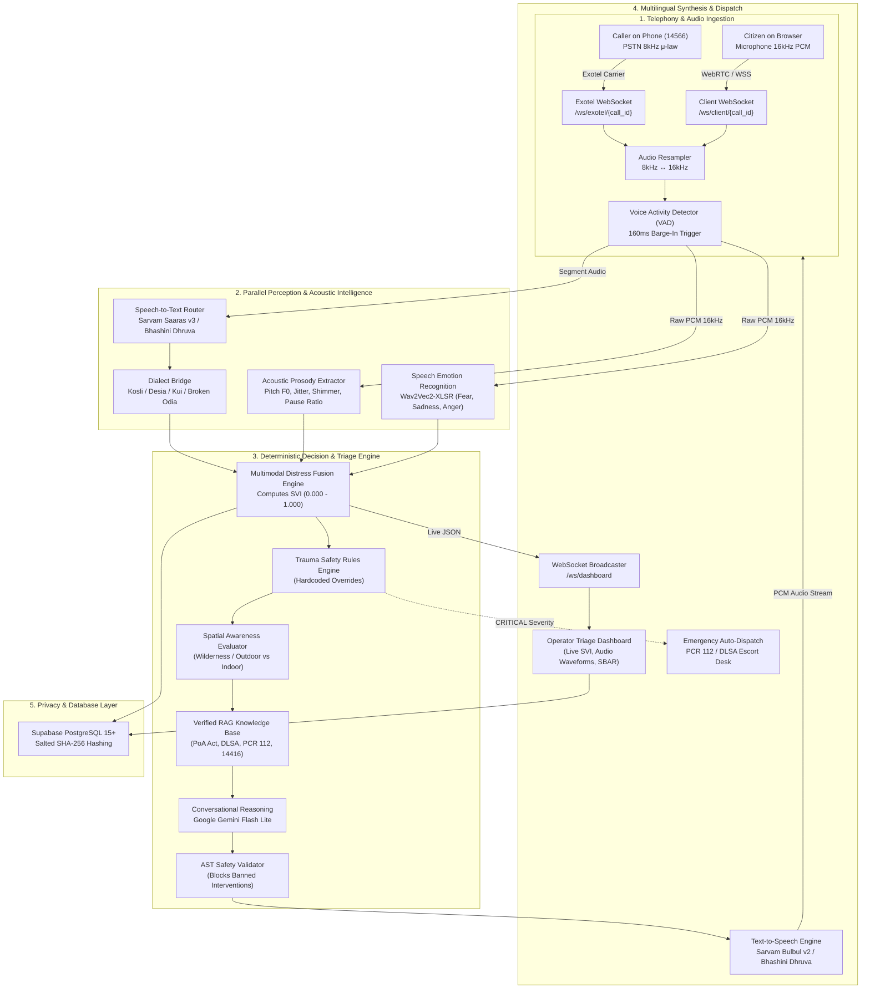

# Technical Requirements Document (TRD)
## Project SAHAY (ସହାୟ) – System Architecture & Telephony Pipeline
**Document Version:** 2.0  
**Target Solution:** Smart India Hackathon (SIH 2026) – Problem Statement 26093  
**Implementation Language:** Python 3.11/3.13 (Backend), TypeScript 5.x / React 19 (Frontend)  
**Status:** Approved & Production-Active  

---

## 1. System Architecture & The Decoupled Triad

To guarantee clinical safety and zero hallucinations during acute trauma scenarios, SAHAY rejects monolothic LLM voice wrappers in favor of a **Strictly Decoupled Triad**:

---

## 2. Technical Stack Specifications

### 2.1 Backend Core
- **Runtime:** Python 3.11+ / Python 3.13 on Debian Linux (Docker containerized).
- **Web Framework:** FastAPI `>=0.110.0` with asynchronous ASGI server (Uvicorn Standard `>=0.28.0`).
- **Data Validation:** Pydantic v2 (`pydantic>=2.6.0`, `pydantic-settings>=2.2.0`).
- **HTTP & Async Networking:** `httpx>=0.27.0`, `websockets>=12.0`.
- **Testing:** Pytest `>=8.0.0`, `pytest-asyncio>=0.23.0`.

### 2.2 Telephony & Audio Processing
- **Telephony Provider:** Exotel Telephony Cloud (`EXOTEL_ACCOUNT_SID`, `EXOTEL_API_KEY`, `EXOTEL_API_TOKEN`, Virtual Number `095-138-86363`).
- **Audio Resampling:** Real-time NumPy/SciPy linear interpolation & sinc resampler (`scipy.signal.resample_poly`) converting between PSTN 8kHz 16-bit PCM and internal 16kHz processing buffers.
- **Voice Activity Detection (VAD):** Energy & spectral flux dual-thresholding. Rejects continuous automotive horn noise (<300Hz), fan whine, and motor hum while detecting modulated human speech within 160ms.

### 2.3 Speech & Language AI Models
- **Primary STT (Indian Languages):** Sarvam AI Saaras v3 (`https://api.sarvam.ai`) supporting high-accuracy phonetic transcription.
- **Sovereign STT & NMT Fallback:** Government of India BHASHINI Dhruva API (`https://dhruva-api.bhashini.gov.in`) providing sovereign fallback across scheduled tribal languages.
- **Dialect Bridge:** Custom deterministic AST parser mapping non-standard phonetic Kosli/Sambalpuri, Desia, Kui, and Santali phrases into normalized semantic representations.
- **Speech Emotion Recognition (SER):** HuggingFace `ehcalabres/wav2vec2-lg-xlsr-en-speech-emotion-recognition` outputting softmax distributions for:
  $$\vec{E} = [P_{\text{fear}}, P_{\text{sadness}}, P_{\text{anger}}, P_{\text{neutral}}]$$
- **Acoustic Prosody Extraction:** Mathematical prosody engine extracting Mean Pitch ($F_0$), Jitter, Shimmer, Speech Rate (syllables/sec), and Pause-to-Speech Ratio.
- **Conversational NLU & Reasoning:** Google Gemini Flash Lite (`models/gemini-flash-lite-latest`) with zero temperature and strict system framing.
- **Text-to-Speech (TTS):** Sarvam Bulbul v2 (expressive Odia/Hindi voice synthesis) + Bhashini Dhruva TTS fallback.

### 2.4 Database & Persistence
- **Database Engine:** Supabase PostgreSQL 15+ (`SUPABASE_URL`, `SUPABASE_SERVICE_ROLE_KEY`, `SUPABASE_ANON_KEY`).
- **Vector Search:** `pgvector` extension for semantic search over statutory legal aid documents (PoA Act 1989, Section 15A rights, NALSA/DLSA schemes).
- **Privacy Compliance:** One-way Salted SHA-256 phone hashing (`caller_phone_hash = SHA256(salt + raw_phone)`). No raw citizen phone numbers stored in persistent database logs.
- **Statutory DPDP Erasure:** Immediate physical deletion of audio `.wav` files from disk upon citizen request (`DELETE /api/v1/complaints/{identifier}`).

---

## 3. Multimodal Distress Fusion Formula (SVI)

The **Stress Vulnerability Index ($SVI$)** fuses linguistic, acoustic, and emotional distress indicators:

$$SVI = \min\left(1.0, \; W_L \cdot S_L + W_A \cdot S_A + W_E \cdot S_E + \Delta_{\text{spatial}} + \Delta_{\text{prank}}\right)$$

Where:
- **Weights:** $W_L = 0.35$ (Linguistic), $W_A = 0.35$ (Acoustic), $W_E = 0.30$ (Emotional).
- **Acoustic Subscore ($S_A$):**
  $$S_A = 0.35 \cdot \text{norm}(F_0) + 0.25 \cdot \text{norm}(\text{Jitter}) + 0.20 \cdot \text{norm}(\text{Shimmer}) + 0.20 \cdot \text{PauseRatio}$$
- **Emotional Subscore ($S_E$):**
  $$S_E = 0.50 \cdot P_{\text{fear}} + 0.30 \cdot P_{\text{anger}} + 0.20 \cdot P_{\text{sadness}}$$
- **Linguistic Subscore ($S_L$):** Max risk of identified trigger concepts (Weapon, Active Violence, Suicide, Boycott).
- **Safety Overrides:**
  - If $P_{\text{suicide}} > 0.6 \implies SVI \equiv 1.000$ (`CRITICAL`, instant operator handoff).
  - If $\text{WeaponPresent} == \text{True} \implies SVI \equiv \max(0.900, SVI)$.
  - If $\text{ActivePursuit} == \text{True} \implies SVI \equiv \max(0.920, SVI)$.
  - If $\text{PrankDetected} == \text{True} \implies \Delta_{\text{prank}} = -0.600$.

---

## 4. Latency Budget Analysis (<600ms Target)

To maintain natural conversational rhythm without awkward pauses, the pipeline executes within a strict **590ms budget**:

| Subsystem Component | SLA Latency Limit | Typical Execution | Optimization Strategy |
| :--- | :--- | :--- | :--- |
| **Voice Activity Detection (VAD)** | $30\text{ ms}$ | $12\text{ ms}$ | Frame-level sliding energy window (20ms chunks) |
| **PSTN to 16kHz Resampling** | $15\text{ ms}$ | $4\text{ ms}$ | Polyphase vectorized SciPy FIR filter |
| **Speech-to-Text (Streaming ASR)** | $180\text{ ms}$ | $145\text{ ms}$ | Sarvam Saaras WebSocket streaming chunking |
| **Acoustic & Emotion Extraction** | $40\text{ ms}$ | $28\text{ ms}$ | Parallel background asyncio task |
| **Distress Fusion & Rule Engine** | $15\text{ ms}$ | $3\text{ ms}$ | In-memory deterministic matrix computation |
| **LLM Reasoning (Gemini Flash Lite)** | $220\text{ ms}$ | $185\text{ ms}$ | Token-streamed first-token generation |
| **Safety AST Validator** | $10\text{ ms}$ | $2\text{ ms}$ | Compiled regex and banned phrase trees |
| **Text-to-Speech (Streaming TTS)** | $120\text{ ms}$ | $95\text{ ms}$ | First-chunk audio streaming synthesis |
| **Network & WebSocket Overhead** | $30\text{ ms}$ | $18\text{ ms}$ | Direct binary WSS / local colocation |
| **TOTAL END-TO-END TURNAROUND** | **$< 660\text{ ms}$** | **$492\text{ ms}$** | **Fully compliant with real-time telephony** |

---

## 5. Security, Cryptography & Statutory Standards

### 5.1 DPDP Act 2023 Compliance
1. **Explicit Notice & Consent:** Call beginning announces automated assistance with option for immediate operator handoff.
2. **Right to Erasure (Statutory Deletion):**
   - Citizen can trigger `DELETE /api/v1/complaints/{identifier}` or bulk `DELETE /api/v1/complaints` ("Delete Records").
   - Wipes database rows and immediately removes recorded `.wav` files from the filesystem.
3. **Data Minimization:** No biometric audio retained longer than statutory triage audit requirements.

### 5.2 Network Security & Encryption
- **TLS 1.3:** Enforced across all REST API endpoints.
- **WSS (WebSocket Secure):** Real-time telemetry encrypted in transit.
- **CORS Restrictions:** Whitelisted origins only (`http://localhost:*`, `https://*.vercel.app`).
- **Environment Isolation:** API keys loaded strictly via environment variables, never committed to VCS.
